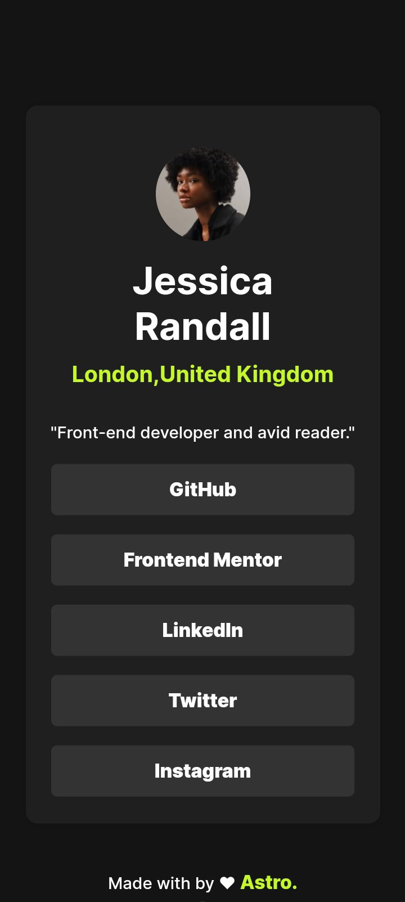

# Frontend Mentor - Social links profile solution

This is a solution to the [Social links profile challenge on Frontend Mentor](https://www.frontendmentor.io/challenges/social-links-profile-UG32l9m6dQ). Frontend Mentor challenges help you improve your coding skills by building realistic projects. 

## Table of contents

- [Overview](#overview)
  - [The challenge](#the-challenge)
  - [Screenshot](#screenshot)
  - [Links](#links)
- [My process](#my-process)
  - [Built with](#built-with)
  - [What I learned](#what-i-learned)
  - [Continued development](#continued-development)
  - [Useful resources](#useful-resources)
- [Author](#author)
- [Acknowledgments](#acknowledgments) 


## Overview

### The challenge

Users should be able to:

- See hover and focus states for all interactive elements on the page

### Screenshot




### Links

- Solution URL: [Add solution URL here](https://github.com/astrovector18/profile-card)
- Live Site URL: [Add live site URL here](https://profile-card-1.onrender.com) 

## My process

### Built with

- Semantic HTML5 markup
- CSS custom properties
- Flexbox

### What I learned

I learnt to apply custom fonts in css using the `@font-face` rule. 

```css
   @font-face {
	font-family: myFont;
	src: url("./assets/fonts/Inter-VariableFont_slnt,wght.ttf");
   }
```


### Continued development

I am definitely gonna consider using a css framework ( tailwindcss maybe) after
sharpening my css skills.

## Author

- Website - [AstroVector](https://github.com/astrovector18)
- Frontend Mentor - [@danieloluwole](https://www.frontendmentor.io/profile/yourusername)
- Twitter - [@astrovector19](https://www.twitter.com/astrovector19)
